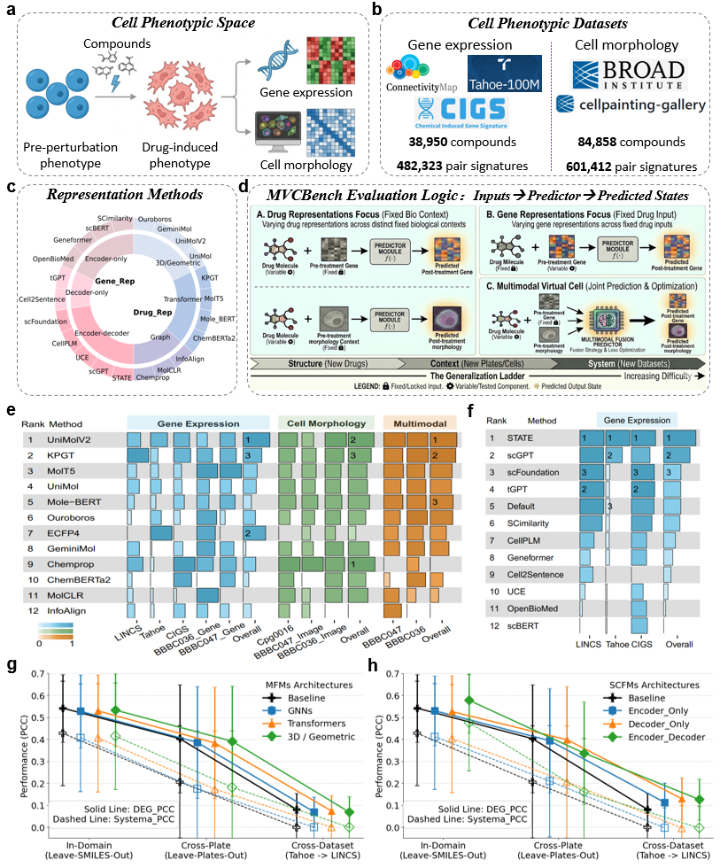

# MVCBench: A Multimodal Benchmark for Drug-induced Virtual Cell Phenotypes

[](https://www.python.org/)
[](./LICENSE)
[](https://qsong-github.github.io/MVCBench/)
[](https://huggingface.co/datasets/Boom5426/MVCBench)

> A systematic benchmark for evaluating molecular and gene representations in predicting drug-induced multimodal virtual cell phenotypes.

[**Project Page**](https://qsong-github.github.io/MVCBench/) | [**Dataset**](https://huggingface.co/datasets/Boom5426/MVCBench) | [**Manuscript**](mailto:qsong1@ufl.edu?subject=MVCBench%20manuscript%20request) `available upon request` | `Preprint coming soon`

---

## Overview

**MVCBench** is a benchmarking framework for studying how representation choices shape the prediction of drug-induced cellular phenotypes across transcriptional and morphological modalities. It systematically evaluates **24 representation methods** spanning **12 drug molecular representations** and **12 gene representation methods** using nearly **1.1 million drug-induced profiles** collected from large-scale transcriptomic and high-content imaging resources.




**Figure 1.** Overview of MVCBench. The benchmark spans transcriptomic, morphological, and multimodal prediction settings, covering large-scale paired profiles, diverse representation models, and progressive evaluation stages from single-modality prediction to multimodal virtual cell construction.


## Key Findings

- Advanced molecular representations are highly beneficial for predicting drug-induced morphological phenotypes, where 3D-aware and deep learning-based encoders consistently outperform classical molecular fingerprints. By contrast, their gains for transcriptomic response prediction are much smaller, suggesting that chemical structure alone may be insufficient to fully explain gene expression responses.

- For transcriptomic prediction, task-specific gene representations show clearer advantages than general-purpose foundation models. This indicates that alignment between representation learning objectives and perturbation-response tasks remains critical, even as single-cell foundation models continue to improve.

- Multimodal integration consistently improves predictive performance over single-modality training. Beyond benchmark scores, MVCBench provides practical guidance for designing multimodal virtual cell systems, including the value of modality-aware optimization and task-dependent fusion strategies.


## 🧬 Benchmark Zoo

We evaluate widely used Drug Molecular Representation methods and Gene Representation methods (Single-cell Foundation Models).

### 🧪 Molecule Representation Methods

| Model | Paper | Code | Stars |
| :--- | :--- | :--- | :--- |
| **KPGT** | [Nat. Commun. 2023](https://www.nature.com/articles/s41467-023-43214-1) | [GitHub](https://github.com/lihan97/kpgt) |  |
| **InfoAlign** | [arXiv 2024](https://arxiv.org/abs/2406.12056) | [GitHub](https://github.com/liugangcode/InfoAlign) |  |
| **GeminiMol** | [Adv. Sci. 2024](https://advanced.onlinelibrary.wiley.com/doi/10.1002/advs.202403998) | [GitHub](https://github.com/Wang-Lin-boop/GeminiMol) |  |
| **Ouroboros** | [Adv. Sci. 2026](https://www.biorxiv.org/content/10.1101/2025.03.18.643899v1) | [GitHub](https://github.com/Wang-Lin-boop/ouroboros) |  |
| **Mole-BERT** | [ICLR 2023](https://openreview.net/forum?id=jevY-DtiZTR) | [GitHub](https://github.com/junxia97/Mole-BERT) |  |
| **ChemBERTa2**| [arXiv 2022](https://arxiv.org/abs/2209.01712) | [GitHub](https://github.com/seyonechithrananda/bert-loves-chemistry) |  |
| **MolT5** | [EMNLP 2022](https://arxiv.org/abs/2204.11817) | [GitHub](https://github.com/blender-nlp/molt5) |  |
| **Chemprop** | [JCIM 2024](https://pubs.acs.org/doi/10.1021/acs.jcim.3c01250) | [GitHub](https://github.com/chemprop/chemprop) |  |
| **MolCLR** | [Nat. Mach. Intell. 2022](https://www.nature.com/articles/s42256-022-00447-x) | [GitHub](https://github.com/yuyangw/MolCLR) |  |
| **UniMol** | [ICLR 2023](https://openreview.net/forum?id=6K2RM6wVqKu) | [GitHub](https://github.com/deepmodeling/Uni-Mol) |  |
| **UniMol2** | [NIPS 2024](https://openreview.net/forum?id=64V40K2fDv) | [GitHub](https://github.com/deepmodeling/Uni-Mol/tree/main/unimol2) |  |

### 🧬 Gene Representation Methods (scFMs)

| Model | Paper | Code | Stars |
| :--- | :--- | :--- | :--- |
| **Geneformer** | [Nature 2023](https://www.nature.com/articles/s41586-023-06139-9) | [HuggingFace](https://huggingface.co/ctheodoris/Geneformer) | ⭐ 281 likes|
| **tGPT** | [bioRxiv 2022](https://www.biorxiv.org/content/10.1101/2022.01.31.478596v1.full) | [GitHub](https://github.com/deeplearningplus/tGPT) |  |
| **UCE** | [bioRxiv 2023](https://www.biorxiv.org/content/10.1101/2023.11.28.568918v2) | [GitHub](https://github.com/snap-stanford/uce) |  |
| **scBERT** | [Nat. Mach. Intell. 2022](https://www.nature.com/articles/s42256-022-00534-z) | [GitHub](https://github.com/TencentAILabHealthcare/scBERT) |  |
| **CellPLM** | [ICLR 2024](https://openreview.net/forum?id=BKXvPDekud) | [GitHub](https://github.com/OmicsML/CellPLM) |  |
| **OpenBioMed** | [arXiv 2023](https://arxiv.org/pdf/2306.04371) | [GitHub](https://github.com/PharMolix/OpenBioMed) |  |
| **scGPT** | [Nat. Methods 2024](https://www.nature.com/articles/s41592-024-02201-0) | [GitHub](https://github.com/bowang-lab/scGPT) |  |
| **scFoundation**| [Nat. Methods 2024](https://www.nature.com/articles/s41592-024-02305-7) | [GitHub](https://github.com/biomap-research/scFoundation)|  |
| **SCimilarity** | [Nature 2025](https://doi.org/10.1038/s41586-024-08411-y) | [GitHub](https://github.com/Genentech/scimilarity) |  |
| **Cell2Sentence**| [ICML 2023](https://icml.cc/virtual/2024/poster/34580) | [GitHub](https://github.com/vandijklab/cell2sentence) |  |
| **STATE** | [bioRxiv 2025](https://www.biorxiv.org/content/10.1101/2025.06.26.661135v2) | [GitHub](https://github.com/ArcInstitute/state) |  |

---

## 💾 Datasets

MVCBench leverages over one million paired observations across transcriptomic and morphological landscapes.

### Gene Expression
- **[CIGS]** (Nat. Methods 2025) - [Dataset Link](https://cigs.iomicscloud.com/)
- **[Tahoe-100M]** (bioRxiv 2025) - [HuggingFace](https://huggingface.co/datasets/tahoebio/Tahoe-100M)
- **[LINCS 2020]** - [Clue.io](https://clue.io/data/CMap2020#LINCS2020)

### Cell Morphology
- **[cpg0016 & cpg0003]** (Cell Painting Gallery) - [AWS Registry](https://registry.opendata.aws/cellpainting-gallery/)

### Multimodal (Paired)
- **CDRP-BBBC047-Bray** & **CDRPBIO-BBBC036-Bray** - Available via the [MVCBench HuggingFace](link_to_your_hf).

The preprocessed dataset used in this paper is available at [MVCBench HuggingFace](https://huggingface.co/datasets/Boom5426/MVCBench).


---


## 🧩 Embedding Extraction

MVCBench provides a unified and easy-to-use interface to extract embeddings using state-of-the-art foundation models.

### Molecular Embeddings (e.g., UniMol2)

Extract single-cell representations from raw gene expression profiles; please refer to [Get_Molecular_Embedding.ipynb](https://github.com/QSong-github/MVCBench/blob/main/examples/Get_Molecular_Embedding.ipynb).


### Gene Embeddings (e.g., STATE)

Extract single-cell representations from raw gene expression profiles; please refer to [Get_STATE_Embedding.ipynb](https://github.com/QSong-github/MVCBench/blob/main/examples/Get_STATE_Embedding.ipynb).

```python
inferer.encode_adata( # https://github.com/ArcInstitute/state
    input_file, 
    output_file, 
    emb_key=embed_key, 
    dataset_name=dataset_name,
    gene_column=gene_column
)

```


## <a id="jump-target"></a>🚀 Getting Started

### Installation

```bash
# Clone the repository
git clone https://github.com/QSong-github/MVCBench.git
cd MVCBench

# Create a virtual environment
conda create -n mvcbench python=3.11
conda activate mvcbench

# Install dependencies
pip install -r requirements.txt

```

### Usage

Run a basic benchmark task (e.g., drug-induced gene expression prediction):

```bash
python main.py --task gene_prediction \
               --molecule_encoder UniMolV2 \
               --gene_encoder STATE \
               --dataset LINCS2020 \
               --split leave_smiles_out

```

For multimodal fusion experiments:

```bash
python main.py --task multimodal_fusion \
               --fusion_strategy late_fusion \
               --loss_weight fixed_ratio

```

---

## 🖊️ Citation

If you find MVCBench useful for your research, please cite our paper:

```bibtex
@article{li2026mvcbench,
  title={MVCBench: A Multimodal Benchmark for Drug-induced Virtual Cell Phenotypes},
  author={Li, Bo and Wang, Qing and Wang, Shihang and Zhang, Bob and Peng, Yuzhong and Zeng, Pinxian and Liu, Chengliang and Li, Mengran and Tang, Ziyang and Yao, Xiaojun and Deng, Chuxia and Song, Qianqian},
  journal={bioRxiv},
  year={2026},
  publisher={Cold Spring Harbor Laboratory}
}

```

## 📧 Contact

For any questions or inquiries, please open an issue or contact:

* **Bo Li**: Boom985426@gmail.com
* **Bob Zhang**: bobzhang@um.edu.mo
* **Qianqian Song**: qsong1@ufl.edu
